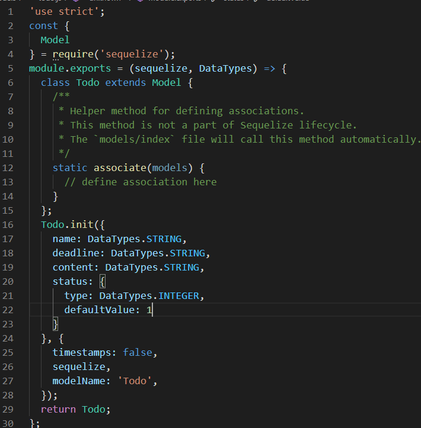
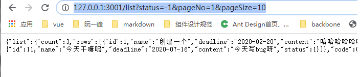
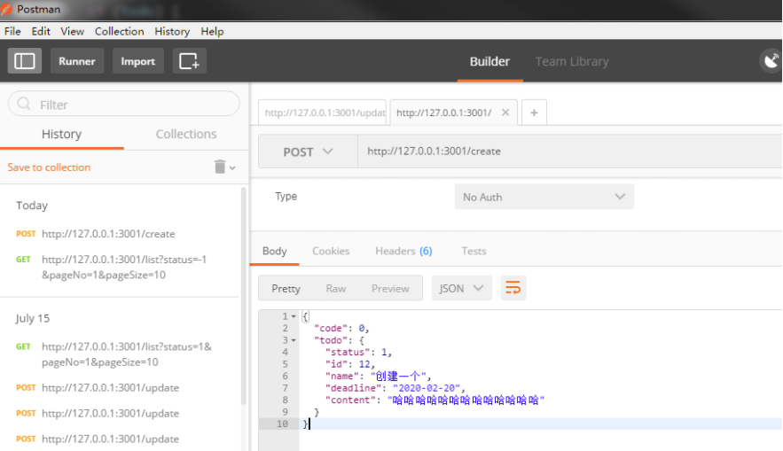
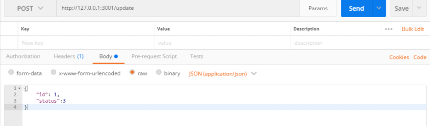
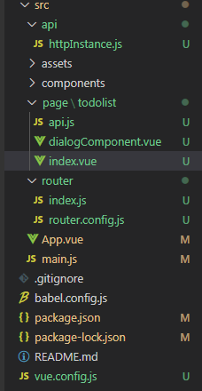
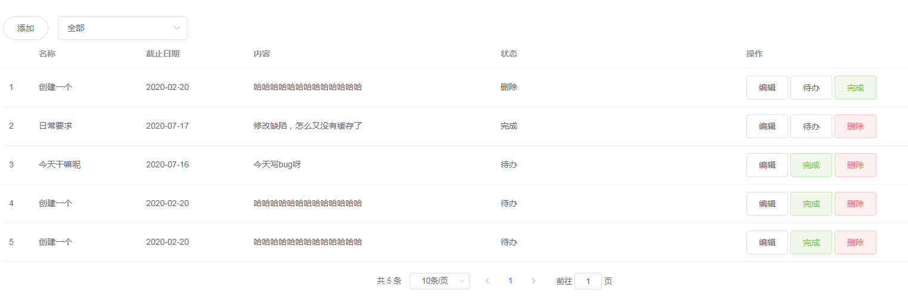
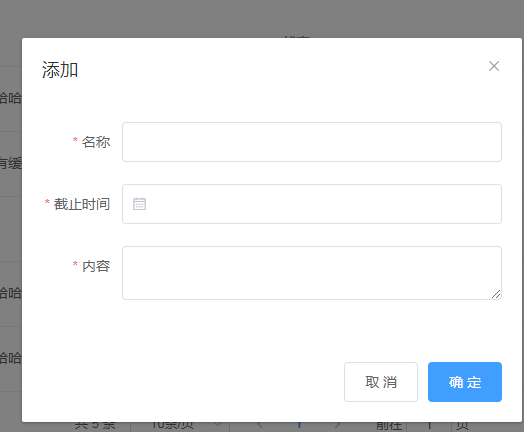

## nodejs编写todolist代码实现
### nodejs端
#### 初始化项目
 `npm init -y`
按最简单的默认init创建项目，当前命令会只生成一个package.json文件
`git init`， 新建`.gitignore`，忽略`node_modules`文件

#### 启动server服务
新建src文件夹，src下新建`app.js`文件，我们的代码会写在这个文件内
下载web框架express：`npm i express -S`
```javascript
const express = require('express')
const app = express()

app.get('/', (req, res) => {
  res.json({
    message: '启动服务'
  })
})
app.listen(3001, () => {
  console.log('server启动成功')
})
```
以上代码会在localhost:3001页面上打印 `{"message": "启动服务"}`，在控制台打印`server启动成功`，是不是很简单，没错，到这里，其实，服务已经成功启动了。接下来，我们就是要在里面加东西了。

#### 使用nodemon自动重启
`npm i nodemon -D`
    因为你每次更改文件，直接刷新是不生效的，一定要重启服务才能生效。而nodemon命令可以监听项目中文件内容的变化，自动重启项目，就可以不用每次都手动去停掉，手动去重启。
 - 在`package.json`文件中增加启动命令： `dev: nodemon ./src/app.js`
 - 根路径下新建`nodemon.json`，更改成只监听src文件夹下的变化，不然会全部监听，没必要
 ```json
 {
    "watch": ["./src/**/*.*"]
 }
```
#### 建立数据库连接（sequelize）
**这里我们用到了sequelize框架，它最直接的作用就是可以让我们不用写sql语句！**
> 框架解释就不在这里赘述了，这里主要是实现todolist

`npm i sequelize -S`
`npm i sequelize-cli -S`
`npx sequelize-cli init` ，建议新建一个db文件夹，在文件夹中init
初始化之后会生成的文件：
- `config` 连接的数据库配置文件
- `migrations` 数据库迁移文件
- `models` 关联数据库表文件
- `seeders` 初始化原始数据文件
1. 根据自己的数据库修改`config/config.json`文件
> 我这边用的是pg数据库（HeidiSQL数据库可视化工具，跟后端童鞋要的安装包），所以要`npm i pg pg-hstore`
```json
"development": {
    "username": "postgres", // 数据库账号
    "password": "123",  // 数据库密码
    "database": "todo_list", // 数据库名称
    "host": "127.0.0.1", // 数据库ip
    "dialect": "postgres", // 数据库类型
    "timezon": "+08:00",  // 时区
    "port": 5433      //  数据库端口号
  }
```
2. 创建数据库模型，命令：
`npx sequelize-cli model:generate --name Todo --attributes firstName:string,lastName:string,email:string`
> npx sequelize-cli 模型:generate --表名称 Todo --属性 字段名:类型,字段名:类型
执行完命令之之后，会在models文件夹下生成一个todo.js文件，migrations文件夹下生成一个数据库迁移文件。`timestamps: false`是后期加的，主要用于去掉表中自带的创建时间和更新时间字段

3. 数据库创建表
`npx sequelize-cli db:migrate --env=development`
使用刚才config/config.json文件中配置的development环境创建表，`--env=development` 可省略，默认使用development。新创建一个数据表，再次执行，不会清空原有数据表中的数据

#### 需求分析
一个todolist无外乎就是增删改查
- 通过pageNo，pageSize，status查询表格数据
- 添加数据：名称，截止日期，具体内容，状态默认为待办
- 修改数据：名称，截止日期，具体内容，状态
- 修改状态：状态

#### 编写接口
##### 查询列表
```javascript
const express = require('express')
const app = express()
const models = require('../models')

app.get('/list', async (req, res, next) => {
  try {
    // 1 待办 2 完成 3 删除 -1 全部， get请求所以用query取值
    let { status, pageNo, pageSize } = req.query
    let offset = (pageNo - 1) * pageSize  // 查询偏移量
    let where = {}  //查询条件
    if (status != -1) {  // 如果状态-1则查全部，不为-1则带上
      where.status = status
    }
    // models.Todo.findAndCountAll 查询Todo表中所有的数据
    // 当前操作是个异步操作，用async await
    let list = await models.Todo.findAndCountAll({
      where,
      offset,
      limit: pageSize
    })
    res.json({
      list,
      code: 0,
      message: '查询列表成功'
    })
  } catch (error) {
    next(error) // 有报错抛出
  }
})
```
可用**postman**（安装下载直接用即可）来测试接口是否正常返回数据，当然也可直接地址栏上输入传参，建议还是用postman，毕竟地址栏只能测get请求


##### 添加
```javascript
const bodyParser = require('body-parser')  //中间件
app.use(express.json()) // 处理json数据
// for parsing application/xwww-form-urlencoded
app.use(express.urlencoded()) // url
// for parsing application/xwww-form-urlencoded
app.use(bodyParser.urlencoded({extend: true}))

app.post('/create', async (req, res, next) => {
  try {
    // post 请求数据在body中，还需要用到以上引入的express自带的处理方式
    let { name, deadline, content } = req.body
    let todo = await models.Todo.create({
      name,
      deadline,
      content
    })
    res.json({
      code: 0,
      todo
    })
  } catch (error) {
    next(error)
  }
})
```
利用postman测试增加一条数据

刷新数据库会多一条数据
##### 修改数据
```javascript

app.post('/update', async (req, res, next) => {
  try {
    let { name, deadline, content, status, id } = req.body
    // 就比添加多了一条，查询特定id的操作，也可将添加和修改写一起
    let todo = await models.Todo.findOne({
      where: {
        id
      }
    })
    if (todo) {
      await todo.update({
        name, deadline, content, status, id
      })
      res.json({
        code: 0,
        todo
      })
    } else {
      res.json({
        message: '没有找到'
      })
    }
  } catch (error) {
    next(error)
  }
})
```


##### 修改状态
修改状态同修改接口类似，只是修改了状态的字段，不赘述了

### 前端vue+elementUI
#### 初始化项目
`vue create font`
`npm i element-ui`
`main.js`中引入`element-ui`
```javascript  
import ElementUi from 'element-ui'
import 'element-ui/lib/theme-chalk/index.css'
Vue.use(ElementUi)
```
#### 路由
路径结构：

新建router文件夹，下新建index.js（路由配置）和router.config.js（路由路径）
router.config.js
```javascript
export default [{
  'path': '/',
  'redirect': '/todolist'
}, {
    'name': 'todolist',
    'path': '/todolist',
    'component': 'todolist/index'
}]
```
index.js
```javascript
import Vue from 'vue'
import Router from 'vue-router'
import routes from './router.config'
Vue.use(Router)
const createRoute = (routes) => {
  return routes.reduce((total, currentRoute) => {
    total.push(processRouteObj(currentRoute))
    return total
  }, [])
}
const processRouteObj = ({name, component, children, keepAlive, ...args }) => {
  return {
    meta: { name,keepAlive },
    // 页面文件都放在page下
    component: () => import(`@/page/${component}`),
    children: children ? createRoute(children) : [],
    ...args
  }
}
const router = new Router({
  mode: 'history',
  base: process.env.BASE_URL,  // '/'
  routes: createRoute(routes) // 路径处理后的集合
})
export default router
```
在main.js中引入，并使用就可以访问页面了
```javascript
import router from './router'

new Vue({
  router,
  render: h => h(App),
}).$mount('#app')

```
#### 页面
页面代码就不放了，反正长这样


#### 调取API
`npm i axios -S`
1. 接口统一处理
```javascript
import axios from 'axios'
const http = axios.create({
  timeout: 6000,
  headers: { 'X-Requested-width': 'XMLHttpRequest' },
  baseURL: process.env.BASE_URL
})
http.interceptors.response.use(res => {
  if (res.data.code === 0) {
    return Promise.resolve(res.data)
  } else {
    return Promise.reject({
      message: res.data.message || '后端返回code非0'
    })
  }
}, error => {
    return Promise.reject(error)
})
export default http
```
2. 接口调取
```javascript
import http from '@/api/httpInstance'
function getPageData (data) {
  return http({
    method: 'get',
    url: '/demo/list',
    params: data
  })
}
export {
    getPageData
}
```
3. 代理地址（vue.config.js）
```javascript
module.exports = {
  devServer: {
    proxy: {
      '/demo': {
        target: 'http://127.0.0.1:3001',
        changeOrigin: true,
        // 因为我们的接口是没有demo字符串的，所以要重写
        pathRewrite: {
          '/demo': ''
        }
      }
    }
  }
}
```
### finally
以上就可以，自己本地起一个后端启一个前端，开始todolist玩啦
